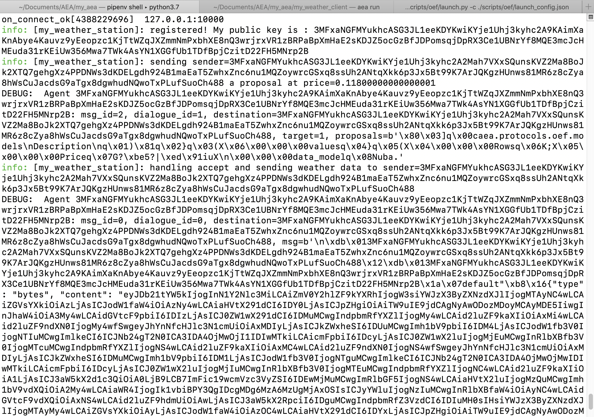
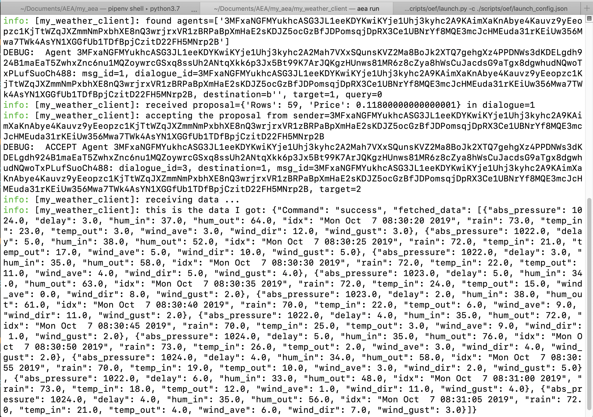

The AEA weather skill demonstrates the interaction between two AEA agents; one as the provider of weather data, the other as the seller of weather data.


## Prerequisites

Make sure you have the latest `aea` version.

``` bash
aea --version
```

If not, update with the following.

``` bash
pip install aea[all] --force --no-cache-dir
```

## Demo instructions

Follow the Preliminaries and Installation instructions <a href="../quickstart" target=_blank>here</a>.


Download the packages and scripts directories.
``` bash
svn export https://github.com/fetchai/agents-aea.git/trunk/packages
svn export https://github.com/fetchai/agents-aea.git/trunk/scripts
```


### Launch the OEF Node:
In a separate terminal, launch an OEF node locally:
``` bash
python scripts/oef/launch.py -c ./scripts/oef/launch_config.json
```

### Create the weather station agent:
In the root directory, create the weather station agent.
``` bash
aea create my_weather_station
```


### Add the weather station skill 
``` bash
cd my_weather_station
aea add skill weather_station
```


### Run the weather station agent

``` bash
aea run
```


### Create the weather client agent
In a new terminal window, return to the root directory and create the weather client agent.
``` bash
aea create my_weather_client
```


### Add the weather client skill 
``` bash
cd my_weather_client
aea add skill weather_client
```


### Run the weather client agent
``` bash
aea run
```


### Observe the logs of both agents

<center></center>

<center></center>


### Delete the agents

When you're done, go up a level and delete the agents.

``` bash
cd ..
aea delete my_weather_station
aea delete my_weather_client
```


## Using the ledger

To run the same example but with a true ledger transaction, do the following.

### Launch the OEF Node

``` bash
python scripts/oef/launch.py -c ./scripts/oef/launch_config.json
```

### Create a weather station (ledger version)

In a new terminal window, create the agent that will provide weather measurements.

``` bash
aea create weather_station 
cd weather_station
aea add skill weather_station_ledger
```

### Create the weather client (ledger version):

In another terminal, create the agent that will query the weather station

``` bash
aea create weather_client 
cd weather_client 
aea add skill weather_client_ledger
```

### Update the agent configs

Both in `weather_station/aea-config.yaml` and
`weather_client/aea-config.yaml`, replace `ledger_apis: []` with:

``` yaml
ledger_apis:
  - ledger_api:
      ledger: fetchai
      addr: alpha.fetch-ai.com
      port: 80
```

### Run the agents
``` bash
aea run
```

### Generate the private key
``` bash
aea generate-key fetchai
```

### Fund the client agent

After you run the client and generate the private key, send your weather client some FET with its FET address (it takes a while):
``` bash
python scripts/fetchai_wealth_generation.py --private-key weather_client/fet_private_key.txt --amount 10000000 --addr alpha.fetch-ai.com --port 80
```


<br/>


