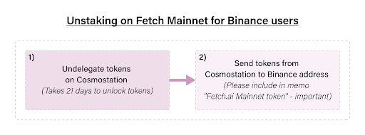
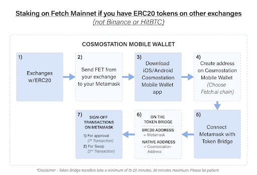

Below you can find different ways one can stake FET. 

## STAKING/UNSTAKING ON FETCH MAINNET FOR BINANCE USERS

Binance has integrated native FET which means you can send your tokens directly to your cosmostation address and start staking. Above is the user journey detailing the steps.

If you need further clarification, please feel free to refer to the section **Applicable for users holding FET on Binance** below.

### How to stake FET using Ledger on Cosmostation Web Wallet: applicable for users holding FET on Binance

[Binance has completed the Fetch.ai (FET) mainnet integration](https://www.binance.com/en/support/announcement/f68b1651b8df40998e109588007bb517). This means Binance has integrated Native FET tokens which can be staked easily on Cosmostation without relying on token bridge. Please follow the below steps:

- **Step 1**: Please head over to [Cosmostation Web Wallet](https://wallet.cosmostation.io/?network=fetchai) (Fetch.ai chain) and create an address for Fetch.ai chain. There is a detailed pdf from the Cosmostation team explaining how to create an account using ledger and how to use the web wallet.

- **Step 2**: Once done, send a small amount of FET as test from your Binance account to your generated Cosmostation address. Make sure the addresses are correct and above all the chain chosen for your generated address is Fetch.ai chain on Cosmostation web wallet.

- **Step 3**: If the tokens arrive, send the rest.

- **Step 4**: Delegate to your preferred validators and start staking.

### How to stake on Fetch Mainnet using Cosmostation Mobile Wallets: applicable for users holding FET on Binance

Binance has completed the Fetch.ai (FET) mainnet integration. This means Binance has integrated Native FET tokens which can be staked easily on Cosmostation without relying on token bridge. Please follow the below steps:

- Step 1: Please consider if you wish to stake FET using Cosmostation iOS or Android mobile apps

For Mobile users: [iOS](https://apps.apple.com/us/app/cosmostation/id1459830339) and [Android](https://play.google.com/store/apps/details?id=wannabit.io.cosmostaion&hl=en&gl=US).

- Step 2: Create Cosmostation address for Fetch.ai chain. There is a detailed pdf from the Cosmostation team explaining how to create an account.

- Step 3: Send a small amount of $FET from your Binance account to your generated cosmostation address. Make sure the addresses are correct and above all the chain chosen for your generated address is Fetch.ai chain on Cosmostation.

- Step 4: If the tokens arrive, send the rest.

- Step 5: Delegate to your preferred validators and start staking.

## STAKING/UNSTAKING ON FETCH MAINNET FOR USERS WITH ACCESS TO MIGRATED TOKENS

Our staking program has moved from Ethereum and we have successfully migrated all the tokens on September 15 — which you can access on our Fetch.ai browser wallet. If you want to access your migrated tokens, here is how you do it.

For those who staked on [staking.fetch.ai] using only Metamask — [Here is the guide](https://medium.com/fetch-ai/staking-migration-guide-how-to-participate-69a60cb5e2eb)

For those who staked on [staking.fetch.ai] using ledger — [Here is the guide](https://fetch.ai/token-migration-guide-for-hardware-wallets/) (refer to Key Migration Desktop)

**_IMPORTANT: BE SURE TO CREATE YOUR COSMOSTATION ADDRESS ONLY FOR FETCH.AI CHAIN._**

Official guide from Cosmostation team on how to generate address on Cosmostation Mobile — [pdf](https://www.cosmostation.io/files/guide_EN.pdf)

Official guide from Cosmostation team on how to generate address on Cosmostation Web Wallet — [pdf](https://www.cosmostation.io/files/cosmostation_guide_web_en.pdf)

Here is the user journey below detailing how to stake on our Mainnet if you have your tokens on the Fetch browser wallet.

To unstake, use this [guide](https://medium.com/fetch-ai/converting-native-to-erc20-using-fetch-ai-browser-wallet-97bb3f8b6b72) which explains how to send tokens back to your metamask using the Fetch browser wallet.

If you need further clarification, please feel free to refer to the section **Applicable for users holding FET on Binance** below.

## STAKING/UNSTAKING ON FETCH MAINNET IF YOU HAVE ERC20 TOKENS ON OTHER EXCHANGES

With the exception of Binance and HitBTC all other exchanges including Coinbase currently hold ERC20 FET. To stake on Mainnet, you must use our [token bridge](https://token-bridge.fetch.ai/) and metamask.

Please feel free to refer to the section **Applicable for users on exchanges with ERC20 FET** below.

To unstake, use this [guide](https://medium.com/fetch-ai/converting-native-to-erc20-using-fetch-ai-browser-wallet-97bb3f8b6b72) which explains how to send tokens back to your metamask using the Fetch browser wallet.

For Ledger users: [Staking on Fetch Mainnet using Ledger and Cosmostation Web Wallet](https://medium.com/fetch-ai/how-to-stake-fet-using-ledger-on-cosmostation-web-wallet-2506ad1f2bc6).

### How to stake FET using Ledger on Cosmostation Web Wallet: applicable for users on exchanges with ERC20 FET

Disclaimer: The guide is a courtesy of Cros-Net who is a validator on Fetch.ai Mainnet.

What do I need:

* Ledger Nano and a Desktop PC, as mobile devices are not yet supported.
* Ledger Live software installed on your PC and an empty MetaMask wallet on your Brave/Chrome Browser. FET ERC20 tokens (except HitBTC all other exchanges
* Head over here — Cosmostation web application (Cosmos Web Wallet) to stake the ERC20 Fetch coins.

This guide also assumes you have Fetch.AI tokens stored in your Ledger Nano Wallet ready to be staked.

**STEP 1 (Install Ethereum and Cosmos Ledger apps)**

After setting up your device with a PIN and passphrase, you should install both the Ethereum and Cosmos wallets through the Ledger Live app.

**STEP 2 (Set specific Ethereum app settings correctly)**

Open the Ethereum app on your Ledger wallet. Within the app, go to settings; make sure "Contract Data" is set to "Allow contract data in transactions". By default this is turned off, it must be turned on so signing the transaction later on won’t fail. Now exit the app.

**STEP 3 (Obtaining Fetch.ai address)**

  1. Open Cosmos app on your Ledger. 
  2. Via Brave/Chrome, go to Cosmos Web Wallet, Cosmostation: https://wallet.cosmostation.io/
  3. On the top right corner, drop down menu, make sure it is set to “fetch.ai”:
  4. Click "Connect Wallet". Click "Connect to Ledger"
  5. Your fetch.ai address will appear in the middle of the screen 
  6. Make a note of this address as it will be needed later when staking 
  7. Logout of Cosmostation website 
  8. Close down the Cosmos App on Ledger Wallet and open up Ethereum App

**STEP 4 (Set MetaMask bridge with Ledger Live Wallet)**

  1. On your Brave/Chrome browser, open the MetaMask wallet. You will now link this wallet with your Ledger via a bridge. Make sure that MetaMask is set to Ethereum Mainnet. 
  2. Open the MetaMask wallet and click on top right corner where it has your profile icon:
    
  3. Choose "Connect Hardware Wallet", a dialog will appear asking you to "Open Ledger Live"
  4. Click "Open Ledger Live". Ledger Live will then ask you to login (if not done so already). Ledger Live will then display "Expose your device accounts through websocket"
  5. Click Open to expose the device via web socket. When doing this for the first time, you will receive a message asking if you want to allow Ledger to make outside connections. Click OK on this. 
  6. Once the connection is established and the bridge is set, Ledger Live will display “Ethereum bridge opened”. Now we can communicate between the two wallets in this process. 
  7. You will also notice that your MetaMask will now have two accounts on Ethereum Mainnet, one which is your original account that was setup with it. The second account is a hardware account linked to Ledger Wallet with "Hardware" displayed next to it.

**STEP 5 (Visit the bridge to move coins onto Cosmostation)**

To complete this phase, visit the bridge at https://token-bridge.fetch.ai/.

* Make sure MetaMask is unlocked so it can be connected onto this bridge. 
* Make sure MetaMask is set to the HARDWARE wallet and that you have enough Ethereum in there to sign the transaction and pay the fees for transfer.

**STEP 6 (Open Wallet and check bridge details)**

The source address (Ethereum address of HARDWARE wallet) will be already filled in, and you will see a blank field for the Native address (this is your Fetch native destination address from STEP 3).

**STEP 7 (Enter Fetch address details and make transfer)**

Paste your address starting with "fetch1", that you identified in STEP 2 into the "Native Address" field, enter the amount, and then click the "Transfer" button. The Ethereum address is connected to the site through Metamask or other browser extension, and needs to be the source from which your tokens will move to Mainnet. The Fetch (Native) address is your destination address, to which they will move on main-net.

**STEP 8 (Sign the transaction — first one)**

This will trigger a transaction that will ask you to "approve" the bridge contract for holding your tokens. After signing the transaction in your Brave/Chrome browser, be sure to also sign it on your physical device (Ledger Nano), and it will be submitted to the Ethereum blockchain. Once this step is done, you can check your Ledger Live and see that the Fetch Tokens have transferred.

As the first transaction is signed, make sure the bridge between Ledger Nano and MetaMask is still running. This is not needed for the second signing below.

**STEP 9 (Sign the transaction — second one)**

To complete the tokens transfer, you will be asked to sign a second transaction. In case this step fails, retry the process again from Step 8 above and you will only need to sign once (since Fetch tokens would have been transferred onto Mainnet).

**STEP 10 (Check tokens transferred to validator area)**

After completing these steps, your Fetch address will be credited with tokens that you can delegate to a validator of your choice to start earning staking rewards. Login to Cosmostation as you did in Step 3. Your coins should be present at the centre of the dashboard.

**STEP 11 (Delegating stake)**

After completing the transfer onto Fetch AI Mainnet and confirming that the coins are now visible on your dashboard, it is time to stake the coins.

  1. Make sure Ledger is unlocked and Cosmos App is running. 
  2. Click on Wallet and select "Reward" (see left hand side of screen)
  3. This will show a list of validators to delegate to. (In case you get an error when trying to open the Reward section, make sure the Cosmos App is unlocked and running on your Ledger). 
  4. Validators are listed at the bottom of the screen. Choose a validator to delegate to by clicking on the “Delegate” button. A dialog will appear.
  5. Enter the amount of Fetch tokens you want to delegate and then click on the “Generate & Sign Transaction” button. 
  6. Confirm this on your Ledger wallet and your coins will be sent to the validator for staking. 
  7. Repeat the process if you wish to delegate to other validators. 
  8. As each validator is added, this will be displayed in the UI of the page.

### How to stake on Fetch Mainnet using Cosmostation Mobile Wallets: applicable for users on exchanges with ERC20 FET

How do I stake on Mainnet 2.0 (ELI5 version)
What you will need:

* A Metamask extension for your browser
* A Cosmostation Wallet (iOS and Android)

Steps:

1. If you do not have the metamask extension installed on your browser. Download it and create an account. Never give out your metamask private key, never give out your mnemonics, and store your password safe. 
2. Set your metamask to receive FET. Click on add token and click on "custom" and add the ERC20 FET address 0xaea46A60368A7bD060eec7DF8CBa43b7EF41Ad85.
3. To send your tokens from your exchange to Metamask — We will take Binance as an example here.

    - Go to Wallet/Overview FIAT and SPOT. 
    - Withdraw your FET and ETH to your metamask account. You will need some ETH to pay for withdrawal. You can also buy ETH on Metamask directly. To withdraw your FET, copy and paste your Metamask address into the field. Always use the ERC20 network to send your FET.

    If you’re on any other exchange, please send your tokens directly to Metamask.

4. Then you wait for Metamask to receive your FET and ETH which may take a few minutes. If you are stuck, please refresh your page but be patient. If you start to get worried, head over to etherscan.io and check your tx hash. If it is successful, it is down to ETH network congestion but your tokens are on their way.

5. Download the Cosmostation Wallet for your phone. Create an account on it. Remember to choose Fetch Mainnet when you’re asked to choose a Cosmo network. Once again you will be asked to store your mnemonics so write them down and keep them somewhere safe.

6. After you have successfully created your wallet on the Cosmostation wallet app, you can go to https://token-bridge.fetch.ai/. Ensure your metamask is connected to the token bridge. Once you have your tokens, connect your metamask with https://token-bridge.fetch.ai/. A new window will pop up and you will be prompted to approve the request to connect.

7. Enter your metamask address in the Ethereum Address, your Cosmostation Wallet address in the Native Address field. Enter the amount of FET you wish to transfer, note that you must send a minimum of 100 FET across the bridge.

    Enter the amount — click transfer — pay for the first little transaction with ETH to approve — once the transaction is approved, a metamask pop-up should come asking to pay for the swap. Please pay the second transaction with ETH.

    If the first transaction succeeds but nothing comes on the page to pay the second transaction : just refresh the page, copy-paste your addresses again, enter again the amount, and you should see the "swap" button now.

8. Once you have transferred and swapped on step "g", check your Cosmostation wallet and wait for a few minutes before the transferred tokens show up. 

9. Once they have arrived you can delegate them to a validator of your choice. **_Congratulations you have successfully staked on Fetch.ai Mainnet 2.0._**
