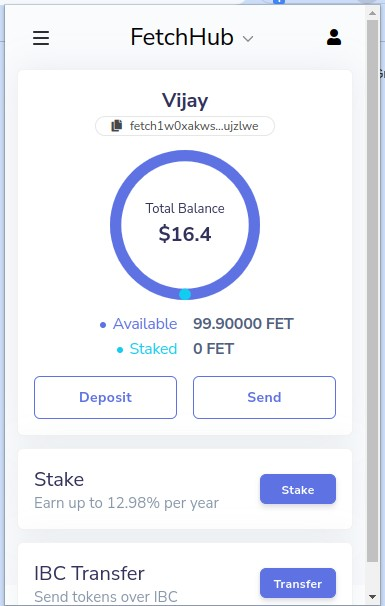
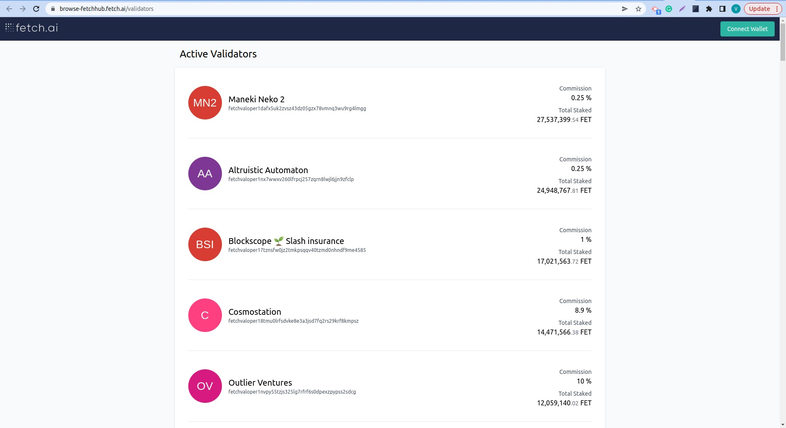

# 🔒 How to stake your FET Tokens

Select Stake on browser extension, you will be redirected to the [web version](https://browse-fetchhub.fetch.ai/validators) of the wallet.

All validators belonging to the active set will be displayed here. You can see the details of each of them, the FETs already at stake, and the expected commissions.

Connect your wallet if your wallet is not connected. 

Once you have chosen your validator, select Stake.
In this new window, you will be asked to select the number of FETs you want to delegate to that validator. Once you have entered this field, press Stake again to continue.

If the details displayed match your requests, click Approve to complete the operation.

## **Operation Successful! Good Job**
 

# 🔓 Claim your Rewards

Don’t forget to Claim your rewards from time to time.

Click on Claim to reclaim all your pending staking rewards.

