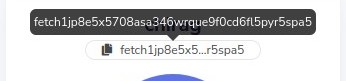

# How to Use the Wallet

## Deposit Tokens

To transfer funds to your account on the Fetch wallet:

In the wallet or application you are using to send the funds, use your account's address as the destination account to which the funds must go.

### To copy your Account's Address

1. Either click on the account address at the top of the dashboard (under the account name):

2. Or select **Deposit** and scan the QR code.

Once you send the tokens, the balance should be updated.

!!! failure
    If your origin wallet says that the address (which should start with "`fetch`") is invalid, it is probably expecting an Ethereum address (beginning with "`0x`") and is most likely trying to send ERC20 FET. In this case, you need to use the [token bridge](https://token-bridge.fetch.ai/) to swap your ERC20 FET for native FET.

!!! warning
    You should **not** send ERC20 FET to this wallet. If you do, you will lose your tokens. The Fetch wallet can only hold native FET tokens and not ERC20 FET tokens.

## Send Tokens

To send tokens from your account:

1. Select **Send**.
2. Fill in the details of your transaction:
    * **Recipient**: the address you want to send the tokens to
    * **Token**: the token denomination or type
    * **Amount**: the number of tokens you want to send with this transaction (you can see your current balance above the **Amount**)
    * **Memo (Optional)**: some transactions (e.g. to/from some exchanges) require a specific memo. If not needed, you can leave it blank.
    * **Fee**: the transaction fee. Choose from **Low**, **Average** and **High**

    !!! tip
        Usually, the lower the transaction fee, the longer you need to wait for your transaction to be settled on the network.

3. Press **Send**.
4. In the summary screen, review the details and if everything is correct, select **Approve**.

!!! tip
    You can check the status of your transaction via [the explorer](https://explore-fetchhub.fetch.ai).
