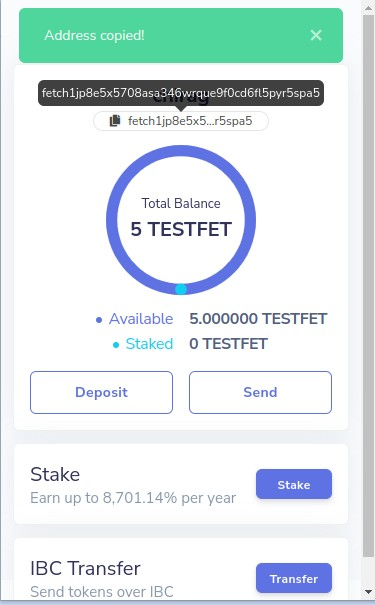
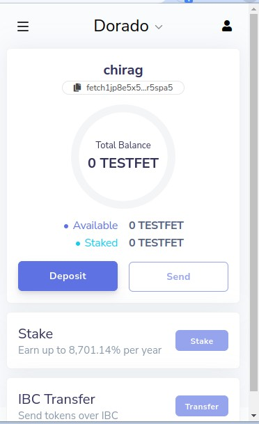
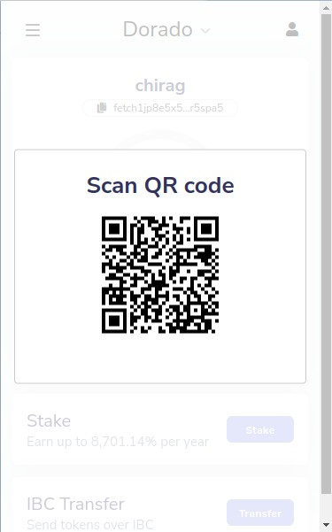
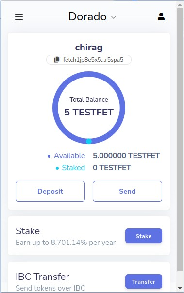
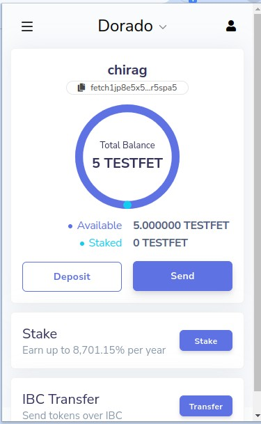
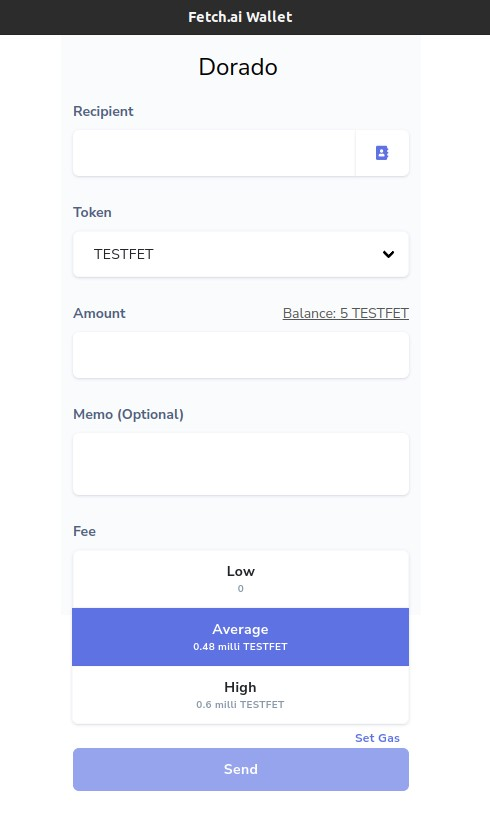
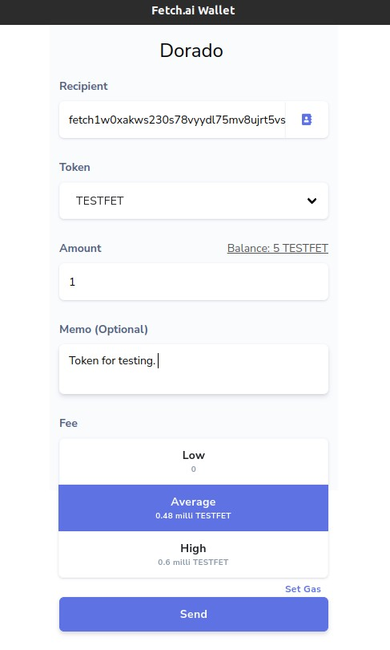
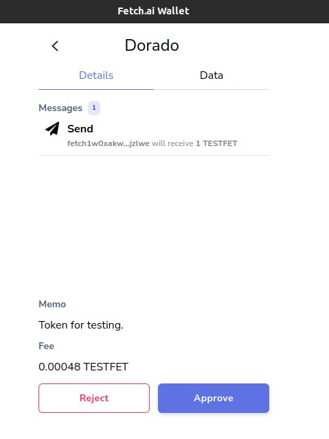

# How to deposit your Tokens

To transfer funds to the active account you will need to copy its address to the sending wallet or application.

Clicking on the account address towards the top of the dashboard (below the account name) will copy it to the clipboard. This address can be used to send supported tokens using the (native) fetch network.

Clicking on the **Deposit** button opens a modal with a QR code which contains the address of the active account.

Once you’ve sent your tokens to your active account address, you will visualize the available balance.

## Troubleshooting

If your origin wallet says that the address (which should start with the word "fetch") is invalid, it is probably expecting an ethereum address (beginning with "0x") and is most likely trying to send ERC20 FET.
In this case, you need to use the [token bridge](https://token-bridge.fetch.ai/) to swap your ERC20 FET for native FET.

# How to send your Tokens

From the dashboard, click on the **Send**

You will visualize multiple fields:

- Recipient: the address you want to send tokens.
- Token: Select the type of token to send.
- Amount: the number of tokens you want to send with this transaction
- Balance: this displays the funds at your disposition
- Memo (Optional): as you know, transaction to/from exchanges most of the time requires a specific memo. Please check carefully if this is your case. If not, you can leave it white.
- Fee: you can choose between [Low], [Average] and [High].

Only a few validators admit low fee transactions, so that might translate to a longer waiting time to have the process done.

When all fields are accurately entered, Click sent. 

A summary screen will now appear.
If all the information are correct, click **Approve** to complete the operation.

You can easily check the status of your transaction via explorer.

# IBC transfer

_NOTE: In order to send IBC transactions, the "Show Advanced IBC Transfers" setting must be toggled on.
To navigate to the settings page from the dashboard, click on the hamburger menu (top-left).
Then click on "Settings"._

Ensure that the desired origin network is selected on the dashboard (top-center).
If the origin network supports IBC, an "IBC Transfer" section will be visible towards the bottom of the dashboard.

Click the "Transfer" button in the "IBC Transfer" section.

Enter your mainnet destination chain address in the Recipient field, a MEMO (Optional), and click on Next to proceed.

Now enter the number of token you’d like to send to destination chain on the Amount field, select the preferred transaction fee then click Submit.
I suggest using Average or High fees at this time.

On the transaction confirmation page, you can review the details of your transaction. Click on [Approve] to confirm.

### ⚛️ Congratulations & Welcome to the IBC Gang! ⚛️

✏ Notes:

- All IBC Hubs have their own channel ID and knowing this channel ID is necessary to perform the IBC transaction.

- Don’t send tokens via [Interchain Transfer] directly to a CEX: this can cause in most cases the loss of the funds.

## First-time origin/destination transfer

Before transferring between any given origin and destination combination for the first time, IBC channels must be configured in the wallet.

Click the "Select Chain" drop-down.
Click "+ New IBC Transfer Channel".

Select the **destination** chain and enter the **source** channel ID (e.g. "channel-100").
Click "Save".

✏ Notes:

- If you write the wrong number on the Destination Chain Channel ID, extension will reject the operation with the warning "Failed to fetch the channel".

- Remember that you must write the channel ID in lower case (i.e. channel-X)
