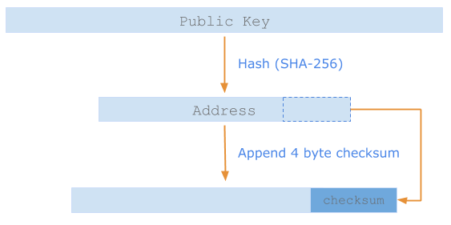

## `Address` type format

The `Address` data structure formats multiple cryptographic public key types.

Currently, `Address` public key types start out as uncompressed <a href="https://en.bitcoin.it/wiki/Secp256k1" target="_blank">ECDSA secp256k1_</a> 64 byte binary arrays. 

An `Address` is generated by hashing the raw bytes of the public key and appending a 4 byte checksum. 

The checksum comes from the hash of the first 4 bytes of the `Address`.


<center>



</center>


The result is `Base58` encoded. 

You can generate test addresses with the  the <a href="https://github.com/fetchai/ledger-api-py" target=_blank>`ledger-api-py`(Python SDK)</a>.

## Create an `Address`

``` java
function main()

  var account = Address("2ifr5dSFRAnXexBMC3HYEVp3JHSuz7KBPXWDRBV4xdFrqGy6R9");

endfunction
```

### Type size in detail

There are two `Address` formats:

* **`INTERNAL`**: This is a straightforward canonical representation of a `sha256` public key and the length is always 32 bytes. This is the `Address` format used inside the Fetch.ai ledger C++ code.

* **`EXTERNAL`**: This is the public format used to interact with the <a href="https://github.com/fetchai/ledger-api-py" target=_blank>Python Ledger HTTP API</a> and also in smart contract `etch` code. The final size of the external `Address` result is between 50-51 bytes as the Base58 encoding process increases the size by a multiple of 1.42.

In Python-type pseudocode below, we show you the steps for producing both types of `Address`. 

``` python
public_key = XYZ

# simple internal representation
canonical_address = sha256(public_key)

# external representation
RAW_public_api_address = concatenate(canonical_address, sha256(canonical_address)[0 : 4bytes])

# check length
assert(36bytes == len(RAW_public_api_address))

# Base58 encoding
public_api_address = Base58(RAW_public_api_address)
```


## SHA256

`etch` currently supports the SHA256 encryption algorithm. Find out more <a href="../crypto" target=_blank>here</a>.


## Verification

The `Address` type has a function `signedTx()` which allows you to verify the signature. It returns a boolean. This is only valid in an `@action` function, else it will return false.

``` java
function main()

  var account = Address("2ifr5dSFRAnXexBMC3HYEVp3JHSuz7KBPXWDRBV4xdFrqGy6R9");
  var verified : Bool;
  verified = account.signedTx(); 
  printLn(toString(verified)); 

endfunction
```

The above code always prints `false` when it is not contained within an `@action` function.

The `Address` type will eventually support *all* asymmetric cryptographic types and, more importantly, will be quantum computing ready.


## Print `Address`

Use `toString()` to print `Address` types.

``` c++
function main()

  var account = Address("2ifr5dSFRAnXexBMC3HYEVp3JHSuz7KBPXWDRBV4xdFrqGy6R9");
  printLn(toString(account));

endfunction
```


<br/>