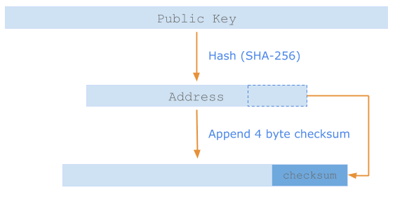

<h1>Address</h1> 

The `Address` data structure formats multiple cryptographic public key types.

Currently, `Address` public key types start out as uncompressed <a href="https://en.bitcoin.it/wiki/Secp256k1" target="_blank">ECDSA secp256k1_</a> 64 byte binary arrays. 

An `Address` is generated by hashing the raw bytes of the public key and appending a 4 byte checksum. The checksum comes from the hash of the first 4 bytes of the `Address`.



The result is `Base58` encoded. 

You can generate test addresses with the  the `ledger-api-py`(Python SDK).

And in `etch`, you can instantiate an `Address` like this:

``` java
function main()

  var account = Address("2ifr5dSFRAnXexBMC3HYEVp3JHSuz7KBPXWDRBV4xdFrqGy6R9");

endfunction
```

## SHA256

`etch` currently supports the SHA256 encryption algorithm .


## Verification

The `Address` type has a function `signed_tx()` which allows you to verify the signature. It returns a boolean. This is only valid in an `@action` function, else it will return false.

``` java
function main()

  var account = Address("2ifr5dSFRAnXexBMC3HYEVp3JHSuz7KBPXWDRBV4xdFrqGy6R9");
  var verified : Bool;
  verified = account.signedTx(); 
  printLn(toString(verified)); // False in v0.4.x ledger code

endfunction
```

The `Address` type will eventually support *all* asymmetric cryptographic types and, more importantly, will be quantum computing ready.


<br/>