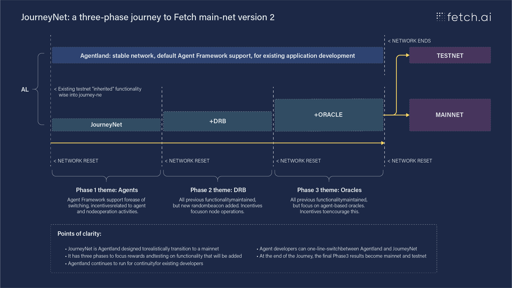

# The Journey to mainnet version 2

Fetch.ai is running three themed, incentivized testnets to take us to mainnet version 2. Each testnet will run for approximately 6 weeks, and will be arranged in groups of incentives. The below diagram outlines how this will work. When each incentivized testnet is complete, it will be reset and the new one created. This will reset state, and testing and work will focus on the new functionality added. With each step along the way, we get closer and closer to a fully featured Fetch V2 mainnet.

Throughout this process, Fetch.ai is running a stable testnet called Agentland. Agentland will not have its state reset, and is perfect for application and agent development and deployment.

When the funky incentivized testnet is complete, mainnet v2 will be launched.

