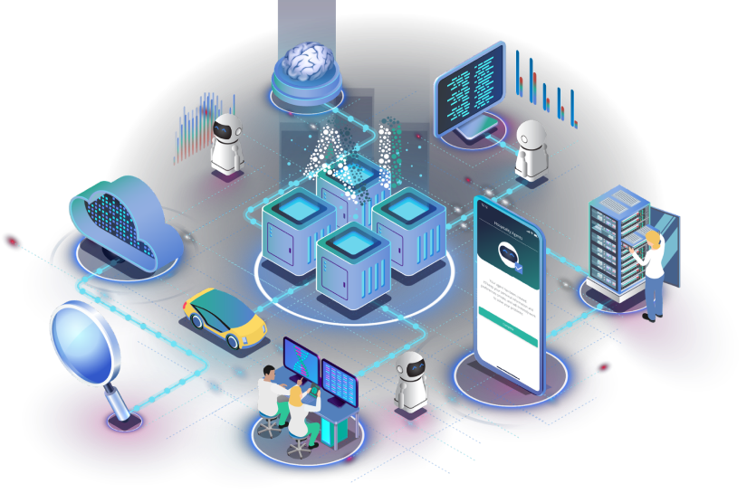

# Welcome to Fetch.ai ecosystem

## What is fetch.ai?
Our mission is to build the infrastructure required for developing modern decentralized & peer-to-peer (P2P) applications that are free from centralized rent-seeking.

We achieve this by providing open-source software tools that can be used with our interoperable Fetch decentralized network. Using these tools and the Fetch.ai blockchain network, you can harness the power of AI and automation to carry out complex coordination in the digital economy.

## Get started with Fetch.ai and build your decentralized apps

The fetch ecosystem is made up of various tools, frameworks and systems. Select any of them below to jump right in:

    

        
User facing tools

        

            <a href="/soef/simple-oef" class="diagram-item">
AEA Registry
</a>
            <a href="/aea/multi-agent-manager/" class="diagram-item">
AEA Manager
</a>
            <a href="getting-started/how-to-use-browser-wallet" class="diagram-item">
Fetch Wallet
</a>
            <a href="/ledger_v2/block-explorer" class="diagram-item">
Explorer
</a>
        

    

    

        
Tools that use the chain

        

            

            <a href="/aea" >
                AEA Framework
                <a href="/aea/acn" class="diagram-item-child">
                    
ACN

                </a>
            </a>
            

            
Upcoming feature

        

    

    

        
Tools to directly interact with the chain

        

            <a href="/CosmPy" class="diagram-item">CosmPy</a>
            
Upcoming feature

        

    

    

        
The chain

        

            

            <a href="/ledger_v2">
                Ledger
                <a class="diagram-item-child-disabled">
                    
Cosmwasm

                </a>
            </a>
            

        

    

You can also jump straight into our Github repos:

- [Ledger (fetchd)](https://github.com/fetchai/fetchd)
- [CosmPy](https://github.com/fetchai/cosmpy)
- [AEA (& ACN)](https://github.com/fetchai/agents-aea)
- [Fetch Wallet](https://github.com/fetchai/keplr-extension)

## For Help & Support

If you want to report a bug or request a feature on one of our public projects:

- [Ledger (fetchd)](https://github.com/fetchai/fetchd/issues/new/choose)
- [Cosmpy](https://github.com/fetchai/cosmpy/issues/new/choose)
- [AEA Framework](https://github.com/fetchai/agents-aea/issues/new/choose)
- [Documentation](https://github.com/fetchai/docs/issues/new/choose)

Want to report a security vulnerability? Visit our [Bug Bounty](https://docs.fetch.ai/bug_bounty/).

## For general technical questions or discussions

Visit fetch.ai developer forums:

- [Ledger (fetchd)](https://github.com/fetchai/fetchd/discussions)
- [CosmPy](https://github.com/fetchai/cosmpy/discussions)
- [AEA Framework](https://github.com/fetchai/agents-aea/discussions)
- [Wallet](https://github.com/fetchai/keplr-extension/discussions)

Chat with Fetch.ai developers on [discord](https://bit.ly/3ra5uMI)
