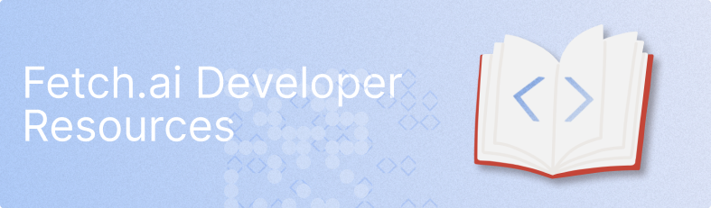

{ align=left }

#

### What is Fetch.ai

There are billions of devices, processes and pipelines around the world that are desperate for **automation** and **communication**. Most blockchains aren't built to handle such a large number of transactions, and none enable their clients to learn from the data generated and exchanged.

Fetch.ai is an **ecosystem** built to bring value to data, by connecting devices and facilitating the **creation of new markets** based on what they learn from each other. It is where truly **autonomous decisions** can be made.

### Here to build agents?

Speed up the development of **Autonomous Economic Agents** using our **AEA framework**.

    <a class="card-button" href="../aea/agent-oriented-development">
    🔵
    Learn the basics
    </a>
    <a class="card-button" href="../aea/quickstart">
    🤖
    Build your first agent
    </a>

Once you’ve built your agent, you’ll want to use the **SOEF** to perform **search and discovery** to find other **agents to trade with**.

    <a class="card-button" href="soef/simple-oef">
    👀
    Learn SOEF
    </a>
    <a class="card-button" href="../aea/simple-oef-usage">
    🔎
    Using SOEF
    </a>
    <a class="card-button" href="../aea/generic-skills-step-by-step">
    📈
    Trading with agents
    </a>
    <a class="card-button" href="../aea/diagram">
    🏛
    Framework Architecture
    </a>

    
### Joining our networks

Learn how to use our [ledger technologies](../ledger_v2) to join our mainnet v2.

### Versions and release notes

As with any software and its documentation, things do change and evolve. We at Fetch.ai try to support backwards compatibility as much as possible, but deprecations will occur. Keep an eye our release notes, as these list all major changes.

Upgrading from a previous version of the agent framework? Here’s our [helpful guide](../aea/upgrading).
