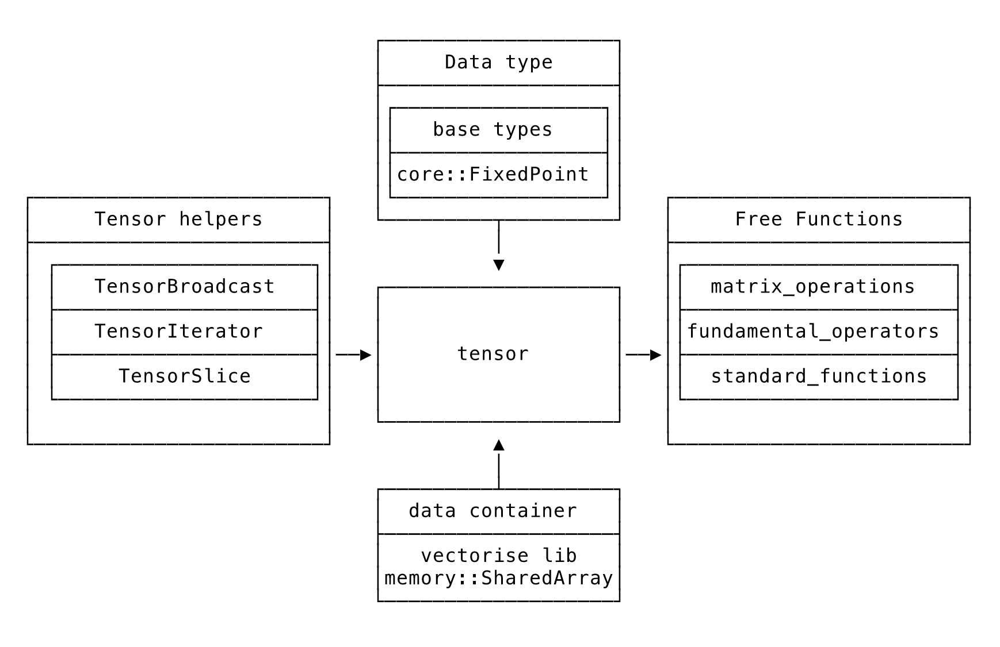

`etch` mathematics and machine learning operations are supported by a header-only fully-templated C++ library. 

!!!	Note
	Detailed developer documentation for the C++ implementation of the maths libraries will be available in the Fetch Ledger section in due course. 
	Developers should be comfortable with SFINAE.

## Architecture

A core component of the maths library is the `tensor.hpp` class which handles N-dimensional array mathematics. This is crucial for the machine learning library but can also be used for any generalised matrix algebra. 

The remainder of the library contains templated free functions that can be called with the following types:

* Built-in C++ types such as `double`, `int`, `float`, etc. 
* C++ tensors of built-in types such as `Tensor<double>`.
* `etch` types such as `Fixed32`. 
* `etch` tensors types such as `Tensor<Fixed32>`.

The header file `fundamental_operators.hpp` contains common operations `Add`, `Subtract`, `Multiply`, and `Divide`.

The file `matrix_operations.hpp` contains `Max`, `ArgMax`, `Product`, `Sum`, `Dot`, etc.

The `standard_functions` directory contains header files for additional standard operations.

The following block diagram gives a rough indication of the library structure.

!!! Advice
	This is work in progress.

## Tensor

A `Tensor` is a wrapper for a `data_` object which is, by default, a `SharedArray` managed by the `vectorise` library. This library manages the vectorisation/SIMD on the underlying data. 

`Tensor` objects provide interfaces for manipulating arrays at a mathematical/algebraic level while allowing implementations to be efficient and vectorisable.

Tensors have related helper classes such as `TensorIterator`, `TensorBroadcast`, and `TensorSlice` that permit efficient and convenient manipulation such as accessing, transposing, and slicing.

In the next section we will look at the available mathematical functions in `etch`.

## Working with the maths library

When working with the C++ maths library, take note of the following:

* Functions should have two interfaces: one that takes a reference to the return object, and one that creates the return object internally.

* Function design decisions should follow Numpy conventions where possible.

 