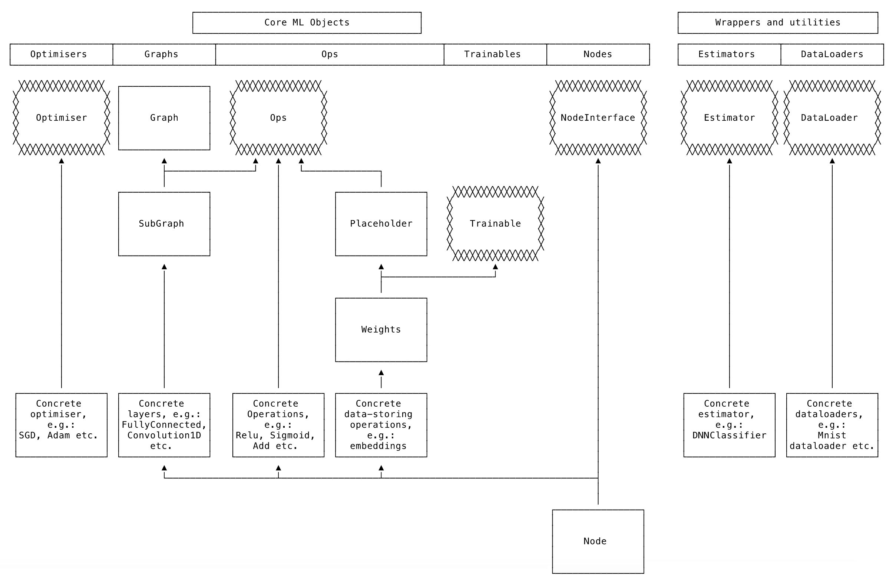

# Machine Learning library architecture

The following block diagram shows the inheritance structure for some of the key components of the ML library.

!!! note
    This is work in progress.

### Graph

`Graph` represents a computational graph made up of nodes.

A `Graph` must be a directed acyclic graph (DAG). Therefore, when adding nodes, the inputs to the nodes must be specified and must never result in a cycle.

`Graph` manages saving and loading existing graph states (a state dictionary) and checking for node name collisions.

Nodes are positions in the graph which know from which other nodes to draw inputs. They are able to perform forward and backward computation according to a particular operation, or `Op`.

Each node is associated with a particular `Op` and this defines the specifics of what happens whenever the forward or backward methods are called. Often the forward method calls upon an existing maths function from the maths library; for example the addition `Op` called on the maths library implementation of `Add`. The backward method computes the gradient associated with the forward operation given a particular error signal.

### Ops

To inject data into the computational `Graph`, special Ops are required that can have data assigned to them. These are placeholders.

Weights are a specialisation of placeholders in that the data assigned to them is randomly initialised and their data is trainable via back-propagation.

Finally there may be further specialisations of weights, such as embeddings, that offer additional functionality with respect to accessing and updating the data.

### Layers

`Layers`, which inherit from `SubGraphs`, are wrappers around multiple Ops that are commonly repeated.

For example, a fully connected layer which wraps the dot product between the weights and the input tensor, followed by the addition of the bias tensor, and possibly also followed by an activation function.

### DataLoaders

`DataLoaders` manage input training data when training the weights in the neural network.

They are responsible for parsing data into a format compatible with the rest of the machine learning library and then sampling the data for training and testing.

A specific `DataLoader` is often needed for each machine learning problem, as input data formats will tend to vary. However, the `DataLoader` abstract class mandates the necessary methods for all `DataLoaders`.

## Integer mathematics

The use of floats and doubles on different architectures is almost always going to result in tiny differences at extremely high levels of precision for two main reasons:

* [The IEEE 754 standard for floating-point arithmetic](https://standards.ieee.org/standard/754-2019.html) does not guarantee that the same program will deliver identical results on all conforming systems
* The C++ standard does not enforce IEEE 754

For many applications this is no problem. However, the Fetch.ai ledger will be computing and storing the results of complex mathematical operations in smart contracts, and these results will be cryptographically hashed. These hashes will need to be _absolutely identical_ on every architecture attempting to verify them. This is not possible with existing machine learning frameworks.

In order to overcome this issue, the machine learning library is compatible with Etch `FixedPoint` data types and Tensors built with them. `FixedPoint` data types implement integer mathematics, guaranteeing identical results on different architectures.

## Notes for working with the C++ machine learning library

-   Every `Op` must have a `DESCRIPTOR`. This generates a unique node name when name collisions are detected in a graph. It is also used for logging/error reporting.

-   Node names are not guaranteed to be identical to the input string specified by the developer on `AddNode`. This is because the graph automatically resolves name collisions such that every node is uniquely named.

-   The function `ComputeOutputShape` for classes that inherit from `Ops` is expensive and should only be used for initialisation or in `ASSERT`. On `Forward` you can use `output.shape()` instead and for `Backward` there is `error_signal.shape()`.

-   Batch dimension is always trailing dimension. If you work with a single data point, it needs to have trailing dimension of size 1.

-   DataLoaders are designed to return a pair of `{Label,{Data}}` where Data are in vector.

 
