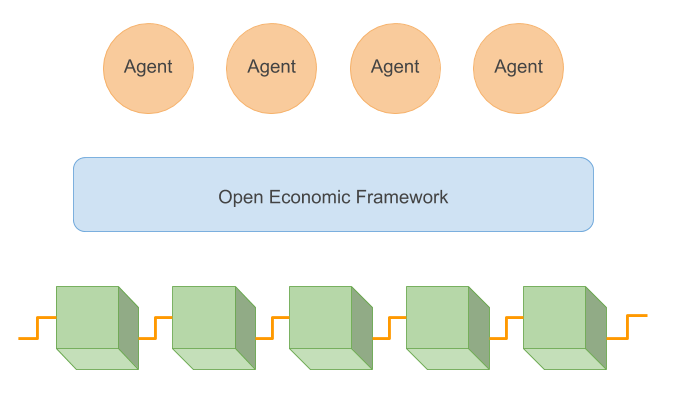

The Open Economic Framework is the Fetch.AI decentralised virtual environment that supplies and supports APIs for autonomous third-party software agents, also known as Autonomous Economic Agents (AEAs).

Autonomous Economic Agents are digital entities that run complex dynamic decision-making algorithms for application owners and clients.

The Fetch.AI blockchain ledger ensures the truth and integrity of the entire system.

The OEF documentation will show you how to build and register an agent, how to advertise and search for services, and explain how the negotiation protocol works.

We have detailed API documentation in Python and a set of working examples you can try out.

But before you can do anything at all, you need to be running a node. Let's get that sorted right away.

 

