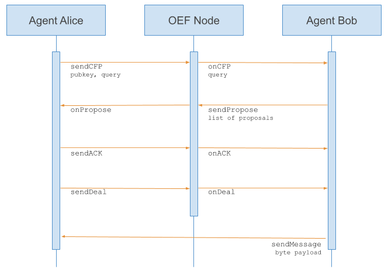

The way Agents communicate is fundamentally different to the object-oriented paradigm. 

Instead of calling Agents directly, communication between Agents is more akin to human language exchanges such as in bartering scenarios.

!!! quote
	Objects do it for free; agents do it because they want to. 

FIPA (Foundation for Intelligent Physical Agents) is a well known standard for agent negotiation. In the OEF, communication follows a minimal subset of the FIPA language. For instance:

* Buying Agent `b` requests a resource `r` from Selling Agent `s`.
* Buying Agent `b` sends a call for proposal `cfp(r)`,  
* Selling Agent `s` replies by sending a proposal to `b` with `propose(r, p)`, where `r` is the resource requested and `p` is the seller’s asking price. 

Specifically, the negotiation system has the following components: 

1. A set of speech-acts where each item may also be called a locution: 

		{cfp(r), propose(r,p), accept(), decline()}

2. A reply structure, where each locution is only a valid reply to some other locutions. This is denoted in the following table:

	| Locution   |      Could reply to      |  
	|----------|:-------------:|
	| cfp(r) |  | 
	| propose(r,p) |    cfp(r) or propose(r,p) |
	| accept() |  propose(r,p) | 
	| decline()|    cfp(r) |

3. A set of *moves* where each move has the following format: 

	`id`	`sender`	`speech-act`	`target`

	Where `id` is the identity of the move in a dialogue, `sender` is the agent who sends this move, `speech-act` is the actual content of the move (i.e. its locution) and target is the `id` of the move this move is replying to. 

A dialogue is then just a sequence of moves, where the first move’s target is 0 (the first move is not replying to any other move in the dialogue).

An example of a simple negotiation between a buying Agent `b` and selling Agent `s` over the resource `r` is as follows: 

|  id  | Agent |   locution   | target |
| -------- |:-------------| :---------:| -------:|
| 1 | b | cfp(r) | 0 |
| 2 | s | propose(r, 20) | 1 |
| 3 | b | propose(r, 10)  | 2 |
| 4 | s | propose(r, 15) | 3 |
| 5 | b | accept() | 4 |

Note the following simple protocol rules:

* The negotiation dialogues always start with a `cfp(r)` move.
* A dialogue terminates when an `accept()` or `decline()` is sent. 
* Agents take turns to send moves in the dialogue. In other words, one agent could only send one move in its turn and has to wait for a response from the other agent before being able to send another move.
* Agents can only reply to the move of the other agent, and not their own.

### Current implementation

In the current version of the OEF SDK, callbacks tell Agents which step of the FIPA protocol has occurred.

For example, Agent Alice sends a `sendCFP` (call for proposal) message containing the public key and query to Agent Bob via the OEF which forwards an `onCFP`.

Agent Bob receives the `onCFP` event and replies with a `sendPropose` containing a list of proposals. 

Bob's `sendPropose` has the same identifier that came with the `onCFP`. This means that Alice can refer back to the `CFP` when she gets the `onPropose` event.

`onACK` and `onDeal` finalise the communication (more).

Finally, Agent Alice receives the byte payload from Agent Bob on `sendMessage`.

Every message contains the following:

* `dialogue id`: the identifier of the dialogue in which the message is sent.
* `destination`: the agent identifier to whom the message is sent.
* `message id`: the message identifier for the dialogue.
* `target`: the identifier of the message to whom this message is answering.

Some other parameters, are included depending on the message.

 
