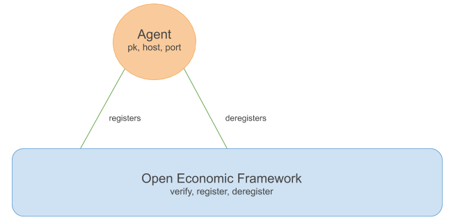

Agents register to and deregister from the OEF.

Before an Agent can advertise or search for services, it must register to the OEF.

Agents are created with a name and public key and they connect to the OEF with an OEF host and port number. 

On attempting to connect to the OEF, the public key is verified.

## Role names

An Agent can perform several roles at once. 

In order to distinguish between roles, an Agent supplies a different name for each role.

This means that an agent could advertise several services using the same public key but different roles names, such as in this example:

| Public key and role name   |      Data members advertised      |  
|----------|:-------------|
| DEADBEEF/newspaper_seller |  available_newspaper_list   available_magazine_list | 
| DEADBEEF/refuelling_station |    petrol_availability   diesel_availability |

When an Agent conducts a search, it receives the public key and the role name of Agent(s) who are advertising matching services. 

!!! note
	KL/KM: Please clarify these statements:
	This is NOT a way of obscuring a public key. It is included so that people can use the same public key (and hence their reliability ratings based off it) to perform different tasks or in different locations or different aspects of the services.

When one Agent communicates with another, it can specify a particular role, allowing the target Agent to easily distinguish what is being asked of them.

A role name can be empty. This is the default case and can be used for simple Agent setups.

In order to talk to Agents with multiple services, we use a Context.

A Context contains source and target information for every message.

The target information, key and role, references the receiving Agent. Similarly the source information references the sending Agent. To send a reply the other way, the two parts can simply be swapped.

 
