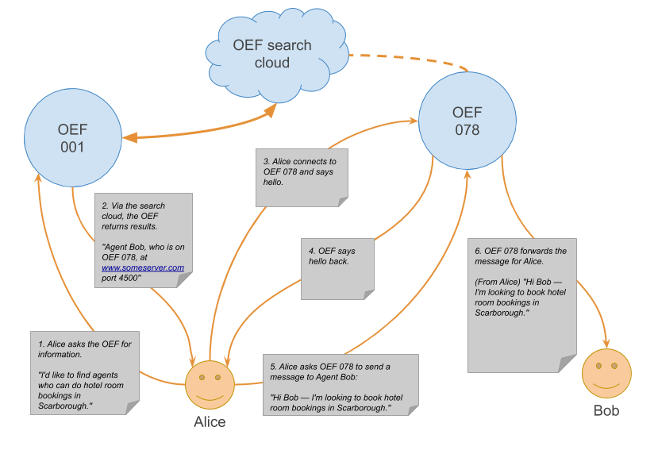
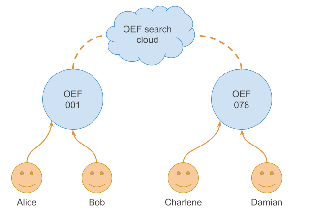

Agent nodes search for services advertised by other Agents. The OEF manages the search process. 

In the example below, Agent Alice is looking for hotel rooms. Agent Bob is a node that has advertised hotel booking services. The OEF matches them up.

<center>



</center>

1. Agent Alice is a node connected to the OEF `001`. She wants to book a hotel room and sends a search request to the OEF. Exactly what a search looks like is up to the agent. In this case, a search should contain the rough location and other specifics. For example, a hotel room provider may advertise a schema containing `room availability`, `parking available`, `breakfast included`, etc.
2. The OEF nodes communicate with each other to find suitable matching agents. Agent Bob looks ideal. OEF `001` returns a list of Agents, their IDs, the OEF node they're attached to, and how to reach it, i.e. an IP address or hostname and port number.
3. Alice decides to talk to Bob. She connects to a shared OEF `078` with the host and port combination she received. At connection time, Alice supplies her ID and answers a verification challenge given by the OEF.
4. Agent Alice verifies successfully and OEF `078` starts talking to Alice.
5. Alice can now ask the OEF to send a message to Bob on her behalf. She uses the ID from the search results as the target and adds her message; in this case a suitable CFP (Call For Proposal) to initiate a conversation with Bob.
6. The OEF sends Alice's message on to Bob along with any other messages Bob is currently receiving from other agents.

## Wide and narrow searches

There are two types of search the OEF supports, wide and narrow searches.

A wide search will generate results from Agents not directly connected to the search initiating Agent.

A narrow search will only generate results from Agents connected directly to the same OEF node. 

For example, in the following diagram, when Charlene does a wide search, results come back from Alice, Bob, and Damian. When Charlene does a narrow search, she only gets results from Damian.

<center>

</center>


### Query language

The Query API allows you to:

* Query the OEF Node about specific kind of services.
* Query other agents to ask them about desired resources.

A `query` is a set of `constraints`, defined over a `data model`.
The outcome is a set of `descriptions` matching the query. 

In the next sections, we describe how to build queries with the Python SDK.

<H4>Constraints</H4>

A `constraint` is associated with an `attribute name` and imposes limitations on the values the attribute can assume.

There are different types of constraints:

<strong>relation</strong>

  * The author of the book must be `Stephen King`.
  * The publication year must be greater than 1990.

<strong>set</strong>

  * The genre must fall into the following set of genres: `Horror`, `Science fiction`, `Non-fiction`.

<strong>range</strong>

  * The average rating must be between 3.5 and 4.5.

<strong>distance</strong>

  * The nearest bookshop must be within a distance from a given location.

The following descriptions and Python examples take you through the query constraint types:

<H5>Relation</H5>

* Equal
* Not equal 
* Less than 
* Less than or equal 
* Greater than
* Greater than or equal 

``` python
from oef.query import Constraint, Eq, NotEq, Lt, LtEq, Gt, GtEq

    # all the books whose author is Stephen King
    Constraint("author", Eq("Stephen King"))

    # all the books that are not of the genre Horror
    Constraint("genre", NotEq("Horror"))

    # all the books published before 1990
    Constraint("year", Lt(1990))

    # the same of before, but including 1990
    Constraint("year", LtEq(1990))

    # all the books with rating greater than 4.0
    Constraint("average_rating", Gt(4.0))

    # all the books published after 2000, included
    Constraint("year", GtEq(2000))
```


<H5>Set</H5>

`Set` is a constraint type that allows you to restrict the values of the attribute
in a specific set.

There are two kind of ``Set`` constraints:

* In (a set of values) 
* Not in (a set of values)


``` python
from oef.query import Constraint, In, NotIn

    # all the books whose genre is one of `Horror`, `Science fiction`, `Non-fiction`
    Constraint("genre", In(["horror", "science fiction", "non-fiction"]))

    # all the books that have not been published neither in 1990, nor in 1995, nor in 2000
    Constraint("year", NotIn([1990, 1995, 2000]))
```

<H5>Range</H5>

`Range` is a constraint type that allows you to restrict the values of the attribute within a given range.

``` python
    from oef.query import Constraint, Range

    # all the books whose title is between 'A' and 'B' (alphanumeric order)
    Constraint("title",   Range(("A", "B")))

    # all the books that have been published between 1960 and 1970
    Constraint("genre",   Range((1960, 1970))
```

<H5>Distance</H5>

`Distance` is a constraint type that allows you to put a limit on a `Location`. More specifically, you can set a maximum distance from a given location (the `center`).

``` python
    from oef.query import Constraint, Distance
    from oef.schema import Location, Description

    # define a location of interest, e.g. the Tour Eiffel
    tour_eiffel = Location(48.8581064, 2.29447)

    # find all the locations close to the Tour Eiffel within 1 km
    close_to_tour_eiffel = Constraint("position", Distance(tour_eiffel, 1.0))

    # Le Jules Verne, a famous restaurant close to the Tour Eiffel, satisfies the constraint.
    le_jules_verne_restaurant = Location(48.8579675, 2.2951849)
    close_to_tour_eiffel.check(Description({"position": le_jules_verne_restaurant}))  # gives `True`

    # The Colosseum does not satisfy the constraint (farther than 1 km from the Tour Eiffel).
    colosseum = Location(41.8902102, 12.4922309)
    close_to_tour_eiffel.check(Description({"position": colosseum}))  # gives `False`
```


### Constraint expressions

The constraints above can be combined with common logical operators, i.e. `and`, `or`, and `not` using he `Not`, `And`, and `Or` classes.

In particular we can specify any conjunction, disjunction, or negation of the previous constraints or composite constraint expression(s). For example:

* Books that belong to `Horror` genre **and** were published after 2000 but **not** authored by `Stephen King`.
* Books whose author is **either** `J. K. Rowling` **or** `J. R. R. Tolkien`.


<H5>Not</H5>

`Not` allows you to specify a negation of a constraint expression.

``` python
from oef.query import Constraint, Not, Range

    # all the books whose year of publication is not between 1990 and 2000
    Not(Constraint("year", Range((1990, 2000)))
```

<H5>And</H5>

`And` allows you to specify a conjunction of constraints over an attribute. There must be **at least** 2 subexpressions.

``` python
from oef.query import Constraint, And, NotEq, Range

    # all the books whose title is between 'I' and 'J' (alphanumeric order) but not equal to 'It'
    And([Constraint("title", Range(("I", "J"))), Constraint("title", NotEq("It"))])
```

<H5>Or</H5>

`Or` allows you to specify a disjunction of constraints. The number of subexpressions must be **at least** 2.

``` python
from oef.query import Constraint, Or, Lt, Gt

    # all the books that have been published either before the year 1960 or after the year 1970
    Or([Constraint("year", Lt(1960)), Constraint("year", Gt(1970))])
```

### Queries

A `query` is a `list of constraint expressions`.

``` python
from oef.query import Query, Constraint, Eq, Gt, Eq

    # return all the books written by Stephen King published after 1990, and available as an e-book:
    Query([
        Constraint("author", Eq("Stephen King")),
        Constraint("year", Gt(1990)),
        Constraint("ebook_available", Eq(True))
    ], book_model)
```

Where `book_model` is the `DataModel` object. Although the `DataModel` is
an optional parameter, we recommended including it.

<H5>The check method</H5>

The `check` method checks whether a `Description` matches the `Query`.

``` python
from oef.query import Query, Constraint, Eq, Gt, Eq
from oef.schema import Description

    q = Query([
        Constraint("author", Eq("Stephen King")),
        Constraint("year", Gt(1990)),
        Constraint("ebook_available", Eq(True))
        ])

    # With a query, you can check that a `~oef.schema.Description` object satisfies the constraints.

    q.check(Description({"author": "Stephen King", "year": 1991, "ebook_available": True}))  # True
    q.check(Description({"author": "George Orwell", "year": 1948, "ebook_available": False})) # False
```

### Validity

A `Query` object must satisfy some conditions before it can be instantiated.

* There must be at least one constraint expression.
* If the data model is specified, then each constraint expression much be validated against the data model.

A `ConstraintExpr` `c` is valid with respect to a `DataModel` according to the following:

* If `c` is an instance of `And`, `Or`, or `Not`, then every subexpression of `c` must be valid with respect to the data model.
* If `c` is an instance of `Constraint`, then:

    - if the constraint type is one of `Lt`, `LtEq`, `Gt`, or `GtEq`, the value in the constructor must be `str`, `int`, or `float`.
    - if the constraint type is a `Range`, then the types in the range must be `int`, `str`,
      `float`, or `Location`.
    - if the constraint type is a `Distance`, then the only valid type is `Location`.
    - if the constraint type is a `Set`, then the types supported are `str`, `int`, `float`, `bool`, `Location`. Notice that a set of `bool` is trivial, so you may find yourself more comfortable using an alternative.
    - for the other constraint types, i.e. `Eq` and `NotEq`, the value can be one of the
      allowed types for `AttributeSchema`, that is `str`, `int`, `float`, `bool`,
      `Location`.

- Moreover, when `c` is a `Constraint`, the attribute must have a consistent type with regards to the data model. For example:

``` python
  Constraint("foo", Eq(True)))
```

Consider a `DataModel` where there is an `AttributeSchema` `foo` of type `str`. Then the constraint is not compatible with the mentioned data model, because
the constraint expects an equality comparison with a boolean `True`, instead of a `str`.

<br/>


