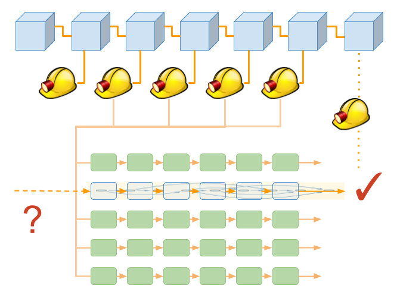

# Introduction to synergetic contracts

Synergetic contracts are a new type of smart contract which allows miners to use their computational power to solve useful problems and earn a reward. Anyone can register a problem on the ledger by creating a synergetic contract and inviting miners to solve it.

The type of problems that synergetic contracts can solve are complex optimisation problems such as [scheduling patient appointments](https://www.ijstr.org/final-print/aug2018/The-Optimized-Algorithm-For-Prioritizing-And-Scheduling-Of-Patient-Appointment-At-A-Health-Center-According-To-The-Highest-Rating-In-Waiting-Queue.pdf) and [protein folding](https://en.wikipedia.org/wiki/Protein_folding).

A miner registers as a participant of the synergetic contract and starts calculating towards the problem solution from a random seed generated from a public key. It is a trial and error approach like proof of work.

Solutions submitted by miners are verified periodically via a function provided by the synergetic contract. The miner that wins the bounty associated with the problem is the one that provides the best solution, according to this function and before the period expires.

  
Note

  
The winning miner is not necessarily the miner who verifies the block.

 
